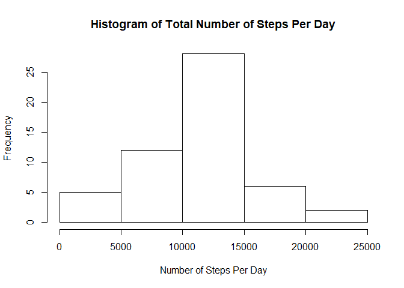
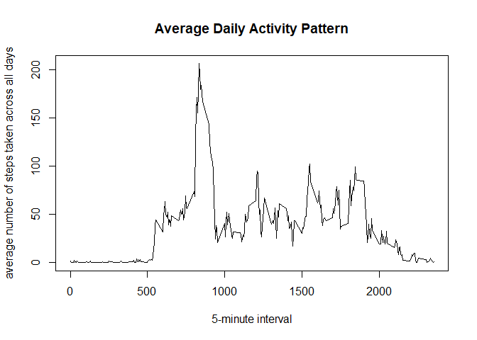
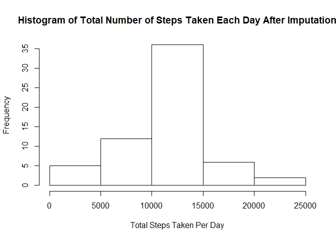
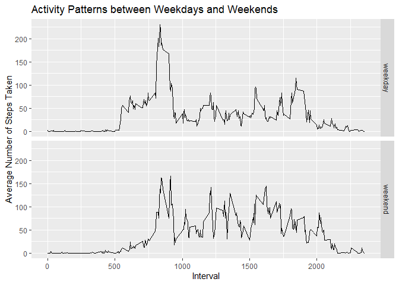

```r
knitr::opts_chunk$set(echo = TRUE)
```

## Loading and preprocessing the data

```r
# Unzip and load the activity dataset
if (!file.exists("./data")){dir.create("./data")}
unzip("./activity.zip",exdir="./data")
activity<-read.csv('./data/activity.csv')
summary(activity)
```

```
##      steps                date          interval     
##  Min.   :  0.00   2012-10-01:  288   Min.   :   0.0  
##  1st Qu.:  0.00   2012-10-02:  288   1st Qu.: 588.8  
##  Median :  0.00   2012-10-03:  288   Median :1177.5  
##  Mean   : 37.38   2012-10-04:  288   Mean   :1177.5  
##  3rd Qu.: 12.00   2012-10-05:  288   3rd Qu.:1766.2  
##  Max.   :806.00   2012-10-06:  288   Max.   :2355.0  
##  NA's   :2304     (Other)   :15840
```

```r
str(activity)
```

```
## 'data.frame':	17568 obs. of  3 variables:
##  $ steps   : int  NA NA NA NA NA NA NA NA NA NA ...
##  $ date    : Factor w/ 61 levels "2012-10-01","2012-10-02",..: 1 1 1 1 1 1 1 1 1 1 ...
##  $ interval: int  0 5 10 15 20 25 30 35 40 45 ...
```

```r
# Transform the date into date format
activity$date<-as.Date(activity$date,format="%Y-%m-%d")

# Transform interval from numeric to factor
activity$interval<-factor(activity$interval)
```


## What is mean total number of steps taken per day?


```r
# Calculate the total number of steps taken per day ignoring missing values
TotalStepPerDay<-aggregate(steps ~ date, data=activity, FUN= function(x) {sum(x,na.rm=TRUE)})

# Make a histogram of total number of stemps taken per day
hist(TotalStepPerDay$steps,
     main="Histogram of Total Number of Steps Per Day",
     xlab="Number of Steps Per Day")
```

<!-- -->

```r
# Calculate the mean and median of the total number of steps taken per day
MeanStepsPerDay<-mean(TotalStepPerDay$steps)
print(MeanStepsPerDay)
```

```
## [1] 10766.19
```

```r
MedianStepsPerDay<-median(TotalStepPerDay$steps)
print(MedianStepsPerDay)
```

```
## [1] 10765
```
Mean of steps taken each day is **10766.19**, and median of steps taken each day is **10765**.

## What is the average daily activity pattern?


```r
library(dplyr)
```

```
## 
## Attaching package: 'dplyr'
```

```
## The following objects are masked from 'package:stats':
## 
##     filter, lag
```

```
## The following objects are masked from 'package:base':
## 
##     intersect, setdiff, setequal, union
```

```r
# Calculate average steps taken per 5-minute interval across all days 
activity2<-activity %>% 
        group_by(interval) %>%
        summarise(AverageStepsPerInterval=mean(steps,na.rm = TRUE))
activity2$interval<-as.numeric(levels(activity2$interval))

# Plot the time series plot 
plot(x=activity2$interval,y=activity2$AverageStepsPerInterval,
     type="l",
     main="Average Daily Activity Pattern",
     xlab="5-minute interval",
     ylab="average number of steps taken across all days")
```

<!-- -->

```r
# Find the interval that contains the max average number of steps
activity2$interval[which.max(activity2$AverageStepsPerInterval)]
```

```
## [1] 835
```
The 5-minute interval that, on average, contains the maximum number of steps is interval **835**.  
## Imputing missing values


```r
# Calculate the number of missing values in the dataset
TotalMissing<-sum(is.na(activity))
print(TotalMissing)
```

```
## [1] 2304
```
The total number of missing values in the dataset is **2304**.  

*The imputation strategy I choose is to replace every missing value in steps with the average steps taken for the 5-minute interval that miaaing value is in.*

```r
# Replace all the missing value in steps with the average steps taken for the 5-minute 
# interval the missing value is in 
steps.imputed<-ifelse(test=is.na(activity$steps),
                      yes=ave(activity$steps,
                              activity$interval,
                              FUN = function(x) mean(x, na.rm =TRUE)),
                      no=activity$steps)
activity.imputed<-activity %>%
        mutate(steps=steps.imputed)

# Make a histogram of the total number of steps taken each day
TotalStepsPerDay.imputed<-aggregate(steps ~ date,
                                             data=activity.imputed,
                                             FUN=sum)
hist(TotalStepsPerDay.imputed$steps,
     main="Histogram of Total Number of Steps Taken Each Day After Imputation",
     xlab="Total Steps Taken Per Day")
```

<!-- -->

```r
# Calculate the mean and median of total number of steps taken per day

MeanStepsPerDay.imputed<-mean(TotalStepsPerDay.imputed$steps)
print(MeanStepsPerDay.imputed)
```

```
## [1] 10766.19
```

```r
MedianStepsPerDay.imputed<-median(TotalStepsPerDay.imputed$steps)
print(MedianStepsPerDay.imputed)
```

```
## [1] 10766.19
```
Mean of steps taken each day is **10766.19**, and median of steps taken each day is **10766.19**.  
The mean is not different from previous mean, but the median is slightly different from previous media value.
There is not much noticible impact of imputing missing data on the estimates of the total daily number of steps.

## Are there differences in activity patterns between weekdays and weekends?


```r
# Create a new factor variable in the dataset two levels - "weekday" and "weekend" indicating whether a given date is a weekday or weekend day

daytype<-weekdays(activity.imputed$date,TRUE)
daytype<-factor(daytype,
       levels=c("Mon","Tue","Wed","Thu","Fri","Sat","Sun"),
       labels = c("weekday","weekday","weekday","weekday","weekday","weekend","weekend"))
activity.imputed$daytype<-daytype

# Create a dataset that summarize the average steps taken for each 5-minute interval across all weekday days
# and all weekend days.
activity.imputed2<-activity.imputed %>%
        group_by(interval,daytype) %>%
        summarise(MeanSteps.Int.Dty=mean(steps))
activity.imputed2$interval<-as.numeric(as.character(activity.imputed2$interval))
# Make the time series plot of the 5-minute interval (x-axis) and the average number of steps taken, averaged 
# across all weekday days or weekend days 
library(ggplot2)
ggplot(data=activity.imputed2,
       aes(x=interval,y=MeanSteps.Int.Dty))+
        facet_grid(.~ daytype)+
        geom_line()+
        xlab("Interval")+
        ylab("Average Number of Steps Taken")+
        ggtitle("Activity Patterns between Weekdays and Weekends")
```

<!-- -->
